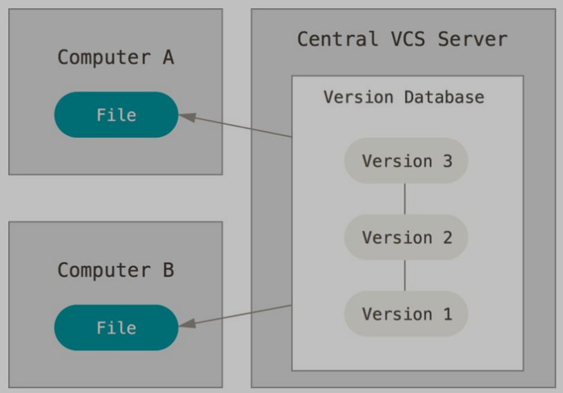
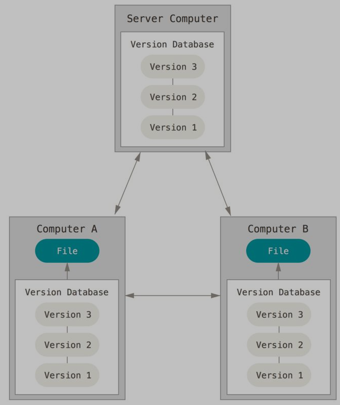
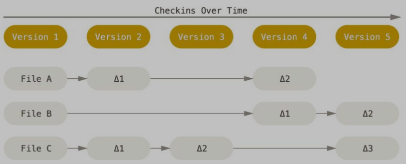
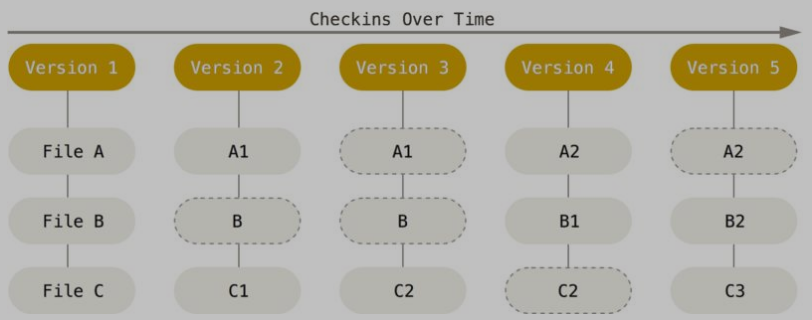

# Version Control

- [Version Control](#version-control)
  - [Local Revision Control](#local-revision-control)
  - [Centralized Version Control Systems](#centralized-version-control-systems)
  - [Distributed Version Control Systems](#distributed-version-control-systems)
  - [Git Basics](#git-basics)
  - [Snapshots, Not Differences](#snapshots-not-differences)
  - [Nearly Every Operation Is Local](#nearly-every-operation-is-local)
  - [Git Has Integrity](#git-has-integrity)
  - [Git Generally Only Adds Data](#git-generally-only-adds-data)
  - [The Three States](#the-three-states)

Version control is a system that records changes to a file or set of files over time so that you can recall specific versions later, and should typically provide 3 basic features reversibility, collaboration and Traceability.

> _Reversibility_ is the ability to back up to a saved, known-good state by having some type of history of all revisions stored,when you discover that some modification you did was a mistake or a bad idea.

> _Collaboration_ is the ability to have many people modifying the same collection of code or documents knowing that conflicting modifications can be detected and resolved.

> _Traceability_ gives back who changed specific file or even lines and in what revision in history which is very useful to track back all changes and when they happend and by who.

## Local Revision Control

Many people just take a copy of the files in another directory (and maybe rename it to a clever name to indicate the changes inside it) , this may solve the reversibility issue by providing some kind of history but still extremely error prone, It is easy to forget which directory you’re in and accidentally write to the wrong file or copy over files you don’t mean to.

To deal with this local VCSs has been developed that had a simple database that kept all changes to files under revision control.

One of the most popular VCS tools was a system called RCS, which is still distributed with many computers today. RCS works by keeping sets (that is, the differences between files) in a special format on disk; it can then re-create what any file looked like at any point in time by adding up all the patches.

## Centralized Version Control Systems

The next major issue that people encounter is that they need to collaborate with developers on other systems. To deal with this problem, Centralized Version Control Systems (CVCSs) were developed. These systems, such as CVS, Subversion, and Perforce, have a single server that contains all the versioned files, and a number of clients that check out files from that central place. For many years, this has been the standard for version control.

This setup offers many advantages, especially over local VCSs. For example, everyone knows to a certain degree what everyone else on the project is doing. Administrators have fine-grained control over who can do what, and it’s far easier to administer a CVCS than it is to deal with local databases on every client.

However, this setup also has some serious downsides. The most obvious is the single point of failure that the centralized server represents. If that server goes down for an hour, then during that hour nobody can collaborate at all or save versioned changes to anything they’re working on. If the hard disk the central database is on becomes corrupted, and proper backups haven’t been kept, you lose absolutely everything  —   the entire history of the project except whatever single snapshots people happen to have on their local machines. Local VCS systems suffer from this same problem  —   whenever you have the entire history of the project in a single place, you risk losing everything.

## Distributed Version Control Systems

This is where Distributed Version Control Systems (DVCSs) step in. In a DVCS (such as Git, Mercurial, Bazaar or Darcs), clients don’t just check out the latest snapshot of the files; rather, they fully mirror the repository, including its full history. Thus, if any server dies, and these systems were collaborating via that server, any of the client repositories can be copied back up to the server to restore it. Every clone is really a full backup of all the data.

## Git Basics

What is Git in a nutshell? This is an important section to absorb, because if you understand what Git is and the fundamentals of how it works, then using Git effectively will probably be much easier for you. As you learn Git, try to clear your mind of the things you may know about other VCSs, such as SVN, doing so will help you avoid subtle confusion when using the tool. Even though Git’s user interface is fairly similar to these other VCSs, Git stores and thinks about information in a very different way, and understanding these differences will help you avoid becoming confused while using it.

## Snapshots, Not Differences

The major difference between Git and any other VCS (Subversion and friends included) is the way Git thinks about its data. Conceptually, most other systems store information as a list of file-based changes. These other systems (CVS, Subversion, Perforce, Bazaar, and so on) think of the information they store as a set of files and the changes made to each file over time (this is commonly described as delta-based version control).

Git doesn’t think of or store its data this way. Instead, Git thinks of its data more like a series of snapshots of a miniature filesystem. With Git, every time you commit, or save the state of your project, Git basically takes a picture of what all your files look like at that moment and stores a reference to that snapshot. To be efficient, if files have not changed, Git doesn’t store the file again, just a link to the previous identical file it has already stored. Git thinks about its data more like a stream of snapshots.

This is an important distinction between Git and nearly all other VCSs. It makes Git reconsider almost every aspect of version control that most other systems copied from the previous generation. This makes Git more like a mini filesystem with some incredibly powerful tools built on top of it.

## Nearly Every Operation Is Local

Most operations in Git need only local files and resources to operate  —   generally no information is needed from another computer on your network. If you’re used to a CVCS where most operations have that network latency overhead, this aspect of Git will make you think that the gods of speed have blessed Git with unworldly powers. Because you have the entire history of the project right there on your local disk, most operations seem almost instantaneous.

For example, to browse the history of the project, Git doesn’t need to go out to the server to get the history and display it for you  —   it simply reads it directly from your local database. This means you see the project history almost instantly. If you want to see the changes introduced between the current version of a file and the file a month ago, Git can look up the file a month ago and do a local difference calculation, instead of having to either ask a remote server to do it or pull an older version of the file from the remote server to do it locally.

This also means that there is very little you can’t do if you’re offline or off VPN. If you get on an airplane or a train and want to do a little work, you can commit happily (to your local copy, remember?) until you get to a network connection to upload. If you go home and can’t get your VPN client working properly, you can still work. In many other systems, doing so is either impossible or painful. In Perforce, for example, you can’t do much when you aren’t connected to the server; and in Subversion and CVS, you can edit files, but you can’t commit changes to your database (because your database is offline). This may not seem like a huge deal, but you may be surprised what a big difference it can make.

## Git Has Integrity

Everything in Git is check-summed before it is stored and is then referred to by that checksum. This means it’s impossible to change the contents of any file or directory without Git knowing about it. This functionality is built into Git at the lowest levels and is integral to its philosophy. You can’t lose information in transit or get file corruption without Git being able to detect it.

The mechanism that Git uses for this checksumming is called a SHA-1 hash. This is a 40-character string composed of hexadecimal characters (0– 9 and a– f) and calculated based on the contents of a file or directory structure in Git. A SHA-1 hash looks something like this:

> 24b9da6552252987aa493b52f8696cd6d3b00373

You will see these hash values all over the place in Git because it uses them so much. In fact, Git stores everything in its database not by file name but by the hash value of its contents.

## Git Generally Only Adds Data

When you do actions in Git, nearly all of them only add data to the Git database. It is hard to get the system to do anything that is not undoable or to make it erase data in any way. As with any VCS, you can lose or mess up changes you haven’t committed yet, but after you commit a snapshot into Git, it is very difficult to lose, especially if you regularly push your database to another repository.

This makes using Git a joy because we know we can experiment without the danger of severely screwing things up. For a more in-depth look at how Git stores its data and how you can recover data that seems lost, see Undoing Things.

## The Three States

Pay attention now  —   here is the main thing to remember about Git if you want the rest of your learning process to go smoothly. Git has three main states that your files can reside in: committed, modified, and staged:

- Committed means that the data is safely stored in your local database.
- Modified means that you have changed the file but have not committed it to your database yet.
- Staged means that you have marked a modified file in its current version to go into your next commit snapshot.

This leads us to the three main sections of a Git project: the Git directory, the working tree, and the staging area.

The Git directory is where Git stores the metadata and object database for your project. This is the most important part of Git, and it is what is copied when you clone a repository from another computer.

The working tree is a single checkout of one version of the project. These files are pulled out of the compressed database in the Git directory and placed on disk for you to use or modify.

The staging area is a file, generally contained in your Git directory, that stores information about what will go into your next commit. Its technical name in Git parlance is the “index”, but the phrase “staging area” works just as well.

The basic Git workflow goes something like this:

1. You modify files in your working tree.
2. You selectively stage just those changes you want to be part of your next commit, which adds only those changes to the staging area.
3. You do a commit, which takes the files as they are in the staging area and stores that snapshot permanently to your Git directory.

If a particular version of a file is in the Git directory, it’s considered committed. If it has been modified and was added to the staging area, it is staged. And if it was changed since it was checked out but has not been staged, it is modified. In Git Basics, you’ll learn more about these states and how you can either take advantage of them or skip the staged part entirely.
