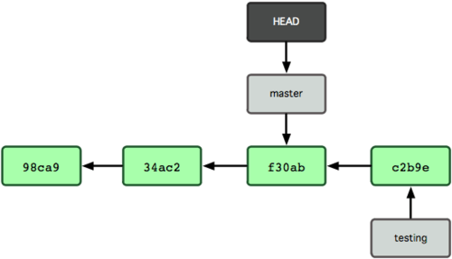
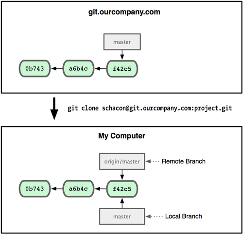

# Git Branching 

## What a Branch Is

To really understand what a branch is, we need to take a step back and examine how Git stores its data. Git doesn’t store data as a series of changesets or deltas, but instead as a series of snapshots.

When you commit in Git, Git stores a commit object that contains a pointer to the snapshot of the content you staged, the author and message metadata.

To visualize this, let’s assume that you have a directory containing three files, and you stage them all and commit. Staging the files checksums each one (the SHA-1 hash), stores that version of the file in the Git repository (Git refers to them as blobs), and adds that checksum to the staging area:

```sh
$ git commit -m 'initial commit of my project'
```

Running git commit checksums all project directories and stores them as tree objects in the Git repository. Git then creates a commit object that has the metadata and a pointer to the root project tree object so it can re-create that snapshot when needed.

Your Git repository now contains five objects: one blob for the contents of each of your three files, one tree that lists the contents of the directory and specifies which file names are stored as which blobs, and one commit with the pointer to that root tree and all the commit metadata. Conceptually, the data in your Git repository looks something like :


If you make some changes and commit again, the next commit stores a pointer to the commit that came immediately before it. After two more commits, your history might look something like:


A branch in Git is simply a lightweight movable pointer to one of these commits. The default branch name in Git is master. As you initially make commits, you’re given a master branch that points to the last commit you made. Every time you commit, it moves forward automatically.


What happens if you create a new branch? Well, doing so creates a new pointer for you to move around. Let’s say you create a new branch called testing. You do this with the ```git branch``` command:

```sh
$ git branch testing
```

This creates a new pointer at the same commit you’re currently on:


How does Git know what branch you’re currently on? It keeps a special pointer called HEAD. this is a pointer to the local branch you’re currently on. In this case, you’re still on master. The ```git branch``` command only created a new branch — it didn’t switch to that branch:


To switch to an existing branch, you run the ```git checkout``` command. Let’s switch to the new testing branch:

```sh
$ git checkout testing
```

This moves HEAD to point to the testing branch:


What is the significance of that? Well, let’s do another commit:


This is interesting, because now your testing branch has moved forward, but your master branch still points to the commit you were on when you ran ```git checkout``` to switch branches. Let’s switch back to the master branch:

```sh
$ git checkout master
```



That command did two things. It moved the HEAD pointer back to point to the master branch, and it reverted the files in your working directory back to the snapshot that master points to. This also means the changes you make from this point forward will diverge from an older version of the project. It essentially rewinds the work you’ve done in your testing branch temporarily so you can go in a different direction.

Let’s make a few changes and commit again, Now your project history has diverged. You created and switched to a branch, did some work on it, and then switched back to your main branch and did other work. Both of those changes are isolated in separate branches: you can switch back and forth between the branches and merge them together when you’re ready. And you did all that with simple branch and checkout commands.


Because a branch in Git is in actuality a simple file that contains the 40 character SHA-1 checksum of the commit it points to, branches are cheap to create and destroy. Creating a new branch is as quick and simple as writing 41 bytes to a file (40 characters and a newline).

This is in sharp contrast to the way most VCS tools branch, which involves copying all of the project’s files into a second directory. This can take several seconds or even minutes, depending on the size of the project, whereas in Git the process is always instantaneous. Also, because we’re recording the parents when we commit, finding a proper merge base for merging is automatically done for us and is generally very easy to do. These features help encourage developers to create and use branches often.

## Remote Branches
Remote branches are references to the state of branches on your remote repositories. They’re local branches that you can’t move; they’re moved automatically whenever you do any network communication. Remote branches act as bookmarks to remind you where the branches on your remote repositories were the last time you connected to them.

They take the form ```(remote)/(branch)```. For instance, if you wanted to see what the ```master``` branch on your ```origin``` remote looked like as of the last time you communicated with it, you would check the ```origin/master``` branch. If you were working on an issue with a partner and they pushed up an ```iss53``` branch, you might have your own local ```iss53``` branch; but the branch on the server would point to the commit at origin/iss53.

This may be a bit confusing, so let’s look at an example. Let’s say you have a Git server on your network at ```git.ourcompany.com```. If you clone from this, Git automatically names it ```origin``` for you, pulls down all its data, creates a pointer to where its ```master``` branch is, and names it ```origin/master``` locally; and you can’t move it. Git also gives you your own ```master``` branch starting at the same place as origin’s ```master``` branch, so you have something to work from.



If you do some work on your local master branch, and, in the meantime, someone else pushes to ```git.ourcompany.com``` and updates its master branch, then your histories move forward differently. Also, as long as you stay out of contact with your origin server, your ```origin/master``` pointer doesn’t move.


To synchronize your work, you run a ```git fetch origin``` command. This command looks up which server origin is (in this case, it’s ```git.ourcompany.com```), fetches any data from it that you don’t yet have, and updates your local database, moving your ```origin/master``` pointer to its new, more up-to-date position.


## Pushing

When you want to share a branch with the world, you need to push it up to a remote that you have write access to. Your local branches aren’t automatically synchronized to the remotes you write to — you have to explicitly push the branches you want to share. That way, you can use private branches for work you don’t want to share, and push up only the topic branches you want to collaborate on.

If you have a branch named ```serverfix``` that you want to work on with others, you can push it up the same way you pushed your first branch. Run ```git push (remote) (branch)```:

```sh
$ git push origin serverfix
Counting objects: 20, done.
Compressing objects: 100% (14/14), done.
Writing objects: 100% (15/15), 1.74 KiB, done.
Total 15 (delta 5), reused 0 (delta 0)
To git@github.com:schacon/simplegit.git
 * [new branch]      serverfix -> serverfix
 ```

This is a bit of a shortcut. Git automatically expands the ```serverfix``` branchname out to ```refs/heads/serverfix:refs/heads/serverfix```, which means, “Take my serverfix local branch and push it to update the remote’s serverfix branch.”, but you can generally leave it off. You can also do ```git push origin serverfix:serverfix```, which does the same thing — it says, “Take my serverfix and make it the remote’s serverfix.” You can use this format to push a local branch into a remote branch that is named differently. If you didn’t want it to be called ```serverfix``` on the remote, you could instead run ```git push origin serverfix:awesomebranch``` to push your local ```serverfix``` branch to the ```awesomebranch``` branch on the remote project.

The next time one of your collaborators fetches from the server, they will get a reference to where the server’s version of ```serverfix``` is under the remote branch ```origin/serverfix```:

```sh
$ git fetch origin
remote: Counting objects: 20, done.
remote: Compressing objects: 100% (14/14), done.
remote: Total 15 (delta 5), reused 0 (delta 0)
Unpacking objects: 100% (15/15), done.
From git@github.com:schacon/simplegit
 * [new branch]      serverfix    -> origin/serverfix
 ```

It’s important to note that when you do a fetch that brings down new remote branches, you don’t automatically have local, editable copies of them. In other words, in this case, you don’t have a new ```serverfix``` branch — you only have an ```origin/serverfix``` pointer that you can’t modify.

To merge this work into your current working branch, you can run ```git merge origin/serverfix```. If you want your own ```serverfix``` branch that you can work on, you can base it off your remote branch:

```sh
$ git checkout -b serverfix origin/serverfix
Branch serverfix set up to track remote branch serverfix from origin.
Switched to a new branch 'serverfix'
This gives you a local branch that you can work on that starts where origin/serverfix is.
```

## Tracking Branches

Checking out a local branch from a remote branch automatically creates what is called a tracking branch. Tracking branches are local branches that have a direct relationship to a remote branch. If you’re on a tracking branch and type ```git push```, Git automatically knows which server and branch to push to. Also, running git pull while on one of these branches fetches all the remote references and then automatically merges in the corresponding remote branch.

When you clone a repository, it generally automatically creates a ```master``` branch that tracks ```origin/master```. That’s why ```git push``` and ```git pull``` work out of the box with no other arguments. However, you can set up other tracking branches if you wish — ones that don’t track branches on origin and don’t track the master branch. The simple case is the example you just saw, running git checkout -b [branch] [remotename]/[branch].

```sh
$ git checkout --track origin/serverfix
Branch serverfix set up to track remote branch serverfix from origin.
Switched to a new branch 'serverfix'
```

To set up a local branch with a different name than the remote branch, you can easily use the first version with a different local branch name:

```sh
$ git checkout -b sf origin/serverfix
Branch sf set up to track remote branch serverfix from origin.
Switched to a new branch 'sf'
Now, your local branch sf will automatically push to and pull from origin/serverfix.
```

## Deleting Remote Branches
Suppose you’re done with a remote branch — say, you and your collaborators are finished with a feature and have merged it into your remote’s ```master``` branch (or whatever branch your stable codeline is in). You can delete a remote branch using the rather obtuse syntax ```git push [remotename] :[branch]```. If you want to delete your ```serverfix``` branch from the server, you run the following:

```sh
$ git push origin :serverfix
To git@github.com:schacon/simplegit.git
 - [deleted]         serverfix
``` 

Boom. No more branch on your server. You may want to dog-ear this page, because you’ll need that command, and you’ll likely forget the syntax. A way to remember this command is by recalling the ```git push [remotename] [localbranch]:[remotebranch]``` syntax that we went over a bit earlier. If you leave off the ```[localbranch]``` portion, then you’re basically saying, “Take nothing on my side and make it be ```[remotebranch]```.”